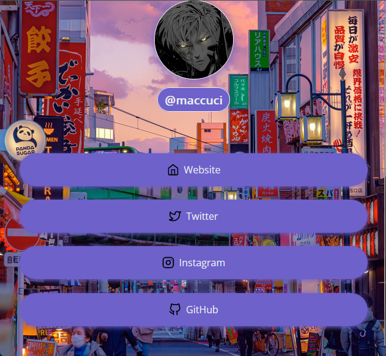

# instagram-links

Projeto clone/inspirado em um sistema como o linktree, para celulares.

OBS: O css foi planejado para telas de celulares somente, então se abrir no
navegador sem usar as dimensões "corretas" de um celular, pode ficar
estranho ou todo errado mesmo.

Ainda não terminei este projeto, nem sei se vou terminar. Mas se quiser usar, pode sem problemas, afinal, é apenas uma inspiração. Caso eu continue, uma lista das coisas que devo colocar:

### Features
- [x] Background
- [ ] Animar o background
- [ ] Adicionar overlays bacanas
- [ ] Colocar uma transição com blur

### Resultado

<h1 align="center">
    
</h1>